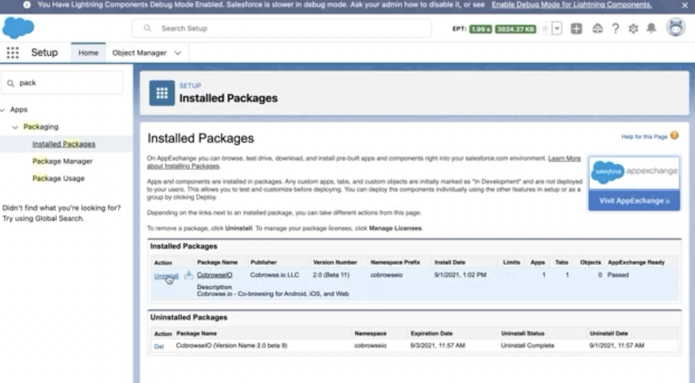
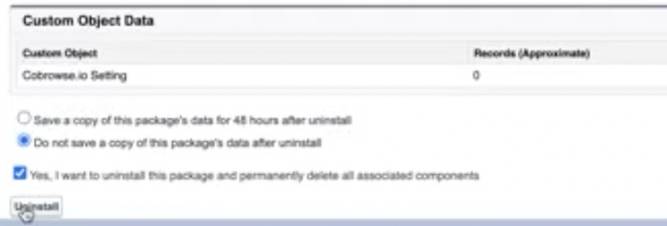

# Migrating from legacy to v2

## Overview

These instructions are only for our existing customers who were using version 1 \(legacy\) of our integration and now need to upgrade to version 2. 

## Existing configuration

Make a note of your existing configurations:

* Permissions for users to access Cobrowse.io, e.g. Permission Sets that your organisation has given access to. 
* Account Settings for Cobrowse.io, e.g. consent requirements. This is found in the admin view of the Cobrowse.io Dashboard app \(search 'Cobrowse.io Dashboard' in app launcher\).
* Custom device filtering that was different from the default "Filter config". This is found in the v1 Cobrowse.io Settings application tab \(search 'Cobrowse.io Settings' in app launcher\).

These settings will be required when configuring v2.

## Uninstall Salesforce legacy

Uninstall our Salesforce legacy integration. Within Salesforce, go to Setup and search for "packages" in the left-hand search bar. Select "Installed Packages".

Select Uninstall next to the CobrowseIO application, and this will take you to the uninstall page for the Salesforce legacy application.

The page will display all of the Cobrowse.io Metadata Components and Custom Object Data that will be uninstalled. You may choose to save the deleted package data or not \(it is not required\) by checking the appropriate boxes.

**Note: your session history, recordings, audit trail etc. will not be deleted with either option above. It will always be preserved and viewable within the new app.**

Check the final box to confirm that the app will be uninstalled and click Uninstall, as shown below.

The uninstall process will take a few minutes before it is completed and you may also be prompted to remove components from individual pages. Removing these components is mandatory for the uninstall.

Once the uninstall is complete, please follow the instructions to install and configure the new app here: [Salesforce](./). 

